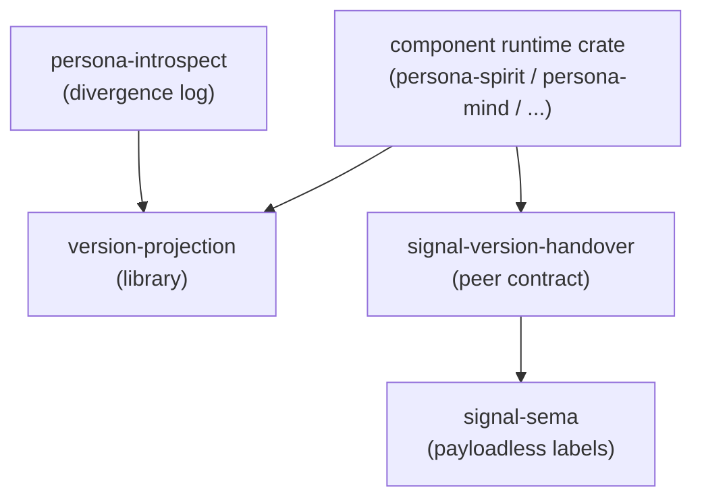

# version-projection — architecture

*Workspace-universal library for projecting values between adjacent
versions of one logical type, plus the policy vocabulary that decides
what a component does with the projection result.*

## Direction

`version-projection` owns the **workspace-universal primitives for projecting typed records between adjacent component versions**. It is a library crate, peer to `signal-sema` in tier: shared vocabulary, no daemon, no socket, no durable store, no component-specific payloads.

The split between projection and policy is load-bearing: `VersionProjection<Source, Target>` says only whether a value can be represented in the target type — it is a pure type relation. What a component does with the result (`Mirror`, `DivergenceRecord`, or `Reject` on write; `ActiveProjectsResponse`, `DualQueryMerge`, or `ActiveOnly` on read) is per-component runtime behaviour in each consuming runtime crate's `version_policy.rs`, never generated by a contract macro.

Forward and reverse projection are the same trait with the type parameters swapped. The blanket `Identity` impl covers `VersionProjection<T, T>` for every `T: Projected` so unchanged types cost zero per-type code. `ProjectionError::NotRepresentable` is the one typed signal policy branches on — it distinguishes "the target genuinely cannot represent this value" from "the transform code failed."

`ContractVersion` stores the schema-version hash as `[u8; 32]` (Blake3) — a binary identity, not a stringly version label. The schema generator emits one `ContractVersion` constant per `signal-X` crate; every type in that crate shares one hash.

The default dependency graph is binary and type-only. The `nota-text` feature turns on NOTA encode/decode impls for human-facing witnesses; runtime daemons depend on the default feature set.

## TL;DR

`version-projection` is a Rust library crate, peer to `signal-sema` in
tier: workspace-universal vocabulary, no daemon, no socket, no redb,
no Persona-specific content. It owns one bidirectional projection
trait, one marker for projected types, payloadless per-operation
 policy records, a runtime migration lookup for locating historical
decoders, and the schema-version hash type. Runtime crates import it
to build per-version transforms; the companion `signal-version-handover`
contract ships beside it for the daemon-to-daemon wire shape, and
`meta-signal-version-handover` owns administrative handover authority.

## Components

| Piece | Owner |
|---|---|
| `VersionProjection<Source, Target>` trait | `src/projection.rs` |
| `Projected` marker (`CONTRACT_VERSION`, `component()`) | `src/projection.rs` |
| `Identity` blanket impl for self-projection | `src/projection.rs` |
| `ProjectionError` (`NotRepresentable` / `TransformFailed` / `DirectionNotImplemented`) | `src/projection.rs` |
| `ComponentPolicy`, `OperationPolicy`, `PerOperationPolicy`, `OperationKind` | `src/policy.rs` |
| `WritePolicy` (`Mirror` / `DivergenceRecord` / `Reject`) | `src/policy.rs` |
| `ReadPolicy` (`ActiveProjectsResponse` / `DualQueryMerge` / `ActiveOnly`) | `src/policy.rs` |
| `SubscribePolicy` (`ResumeAgainstNext` / `TerminateAtHandover`, default `TerminateAtHandover`) | `src/policy.rs` |
| `RuntimeMigrationLookup`, `RuntimeMigrationLookupEntry`, `RecordKind`, `DecodeError` | `src/index.rs` |
| `ContractVersion([u8; 32])`, `ComponentName` | `src/version.rs` |

## Projection contract

Projection is a type relation. The trait says only whether a value can
be represented in the target type:

```rust
pub trait VersionProjection<Source, Target> {
    type Error;
    fn project(source: Source) -> Result<Target, Self::Error>;
}
```

Forward and reverse projection are the same relation with the type
parameters swapped: a forward impl for `(V1, V2)` is independent of a
reverse impl for `(V2, V1)`. A type doesn't bind to one Target; each
`(Source, Target)` is a separate impl. The blanket `Identity` impl
covers `VersionProjection<T, T>` for every `T: Projected`, so unchanged
types cost zero per-type override code; the blanket monomorphises to
`Ok(value)`.

`ProjectionError::NotRepresentable` is the typed signal distinguishing
"target genuinely cannot represent this" from "the transform code
failed." Per-operation policy reads this to choose between
`DivergenceRecord` and `Reject`. Other variants always reject.

## Policy is separate from projection

The trait converts types; per-operation policy decides what to do with
the result. The split is load-bearing — projection is pure type
relation; policy is per-component runtime behaviour. Policy literals
live in the consuming runtime crate (`<component>/src/version_policy.rs`),
not generated by a contract macro: policy is runtime behaviour, not
wire vocabulary.

`WritePolicy` choices:

- `Mirror`: next performs the operation and projects it back to current;
  fallback to `DivergenceRecord` when reverse projection returns
  `NotRepresentable`.
- `DivergenceRecord`: next performs the operation and records that
  current cannot represent it (persona-introspect log home).
- `Reject`: next refuses the operation; the CLI returns an error.

`Reject` is structural — the operation has no equivalent in the other
contract. `DivergenceRecord` is semantic — the shape fits but the value
doesn't represent.

## Version identity

`ContractVersion` stores the schema-version hash as 32 bytes. The NOTA
projection uses the byte-literal form so a schema hash remains a binary
identity, not a stringly version label. The schema generator emits one
`ContractVersion` constant per signal-X crate; every type in that crate
shares one hash.

The NOTA projection is behind the `nota-text` feature. The default
library graph carries the binary hash type, projection traits, policy
enums, and runtime lookup without `nota`. Human-facing CLIs,
schema witnesses, and text round-trip tests opt into `nota-text`;
runtime daemons stay on the default binary graph unless they are
explicitly acting at a human text edge. The optional presentation codec
is pinned to an immutable Nota 0.9 revision. This crate imports no
legacy Nota 0.5 coordination types, so its projection vocabulary cannot
carry codec traits across those two families.

## Runtime migration lookup

`RuntimeMigrationLookup` is the compile-time-or-link-time decoder
lookup for historical signal-X libraries. Each
`RuntimeMigrationLookupEntry` carries a `ComponentName`, a
`ContractVersion`, and a `decode: fn(bytes, kind) -> Result<String,
DecodeError>` pointing at the matching historical crate. The lookup is
built once at startup; lookup is O(n) over a small vector. Adding a new
frozen historical crate adds one entry.

## Boundary



`version-projection` is library-only. It does not own daemon code,
signal-frame transport, component runtime policy enforcement,
persona-spirit-specific migration logic, schema hashing generation, or
the upgrade socket itself.

## Constraints

- The crate is library-only; no daemon binary, no Cargo bin target.
- `VersionProjection<Source, Target>` is a trait with generic type
  parameters, not associated types — the same trait carries forward
  and reverse impls.
- `Identity` is a blanket `VersionProjection<T, T>` for every
  `T: Projected`; self-projection requires no per-type code.
- `ProjectionError::NotRepresentable` is the only error variant policy
  consumers branch on; other variants always reject.
- `ContractVersion` is `[u8; 32]` — Blake3 schema hash, not a string.
- `nota-text` is the only place this crate depends on `nota`; the
  default dependency tree remains binary-only.
- Default `SubscribePolicy` is `TerminateAtHandover`.
- The crate does not depend on `signal-frame`, `signal-sema`, or any
  `signal-persona-*` contract.
- Administrative handover authority lives in
  `meta-signal-version-handover`; this library stays projection and
  policy vocabulary only.
- Mirror payloads are raw bytes on the `signal-version-handover` wire;
  this library supplies projection after the receiver decodes those
  bytes into a versioned type.

## Non-Goals

- No daemon process or socket binding.
- No wire transport — the companion `signal-version-handover` contract
  owns the wire shape.
- No persistent storage.
- No per-component runtime policy enforcement — that lives in each
  component runtime crate alongside its actor tree.
- No schema-hash generation — `ContractVersion` values come from the
  signal-X schema generator at build time.

## Possible features

*Items here are under consideration, not committed. Each names the
open question; moves to the cemented body when settled; retires when
ruled out.*

- **Per-operation policy generation from contract macros.** Today
  policy literals live in each consuming runtime crate. Alternative:
  contract-macro generation from operation annotations. Lean: keep
  runtime literals until policy similarity across components justifies
  promotion.

## Code Map

```text
src/lib.rs           module re-exports
src/projection.rs    VersionProjection, Projected, Identity, ProjectionError
src/policy.rs        ComponentPolicy, PerOperationPolicy, WritePolicy, ReadPolicy, SubscribePolicy, OperationKind
src/version.rs       ContractVersion, ComponentName, ContractVersionError
src/index.rs         RuntimeMigrationLookup, RuntimeMigrationLookupEntry, RecordKind, DecodeError
tests/               trait/policy/index round-trip witnesses
```

## Macro-pattern integration

**Status:** integrated into the brilliant macro library pattern per `reports/designer/326-v13-spirit-complete-schema-vision.md §3` (schemas as macro-pattern instance).

**Role:** this crate owns the `VersionProjection` trait, the `ContractVersion` / `ComponentName` types, the `RuntimeMigrationLookup` index, and the projection / replay machinery component daemons compose into their upgrade flow.

**Integration target:** `VersionProjection` trait the macro emits impls of, derived from schema-diff per `/326-v12 §5`. The schema-engine upgrade computes the diff between adjacent schema versions (additions, removals, shape changes) and emits a per-version `impl VersionProjection` against this crate's trait, so the runtime can project archives across schema-hash boundaries without hand-written migration code. The trait surface stays stable; the macro becomes a new source of impls alongside hand-written ones during the migration window.

**References:**
- `reports/designer/326-v13-spirit-complete-schema-vision.md` — schema language + macro pattern
- `reports/designer/324-migration-mvp-spirit-handover-re-specification.md` — migration MVP
- `reports/operator/174-schema-import-header-design-critique-2026-05-24.md` — lowering + AssembledSchema form

## See also

- `../signal-version-handover/ARCHITECTURE.md` — peer contract crate
  carrying the daemon-to-daemon wire shape.
- `../sema-engine/ARCHITECTURE.md` — owner of `CommitSequence`, the
  per-database high-water mark replay depends on.
- `../sema-upgrade/ARCHITECTURE.md` — handover prototype state
  machine and Nix-owned end-to-end sandbox.
